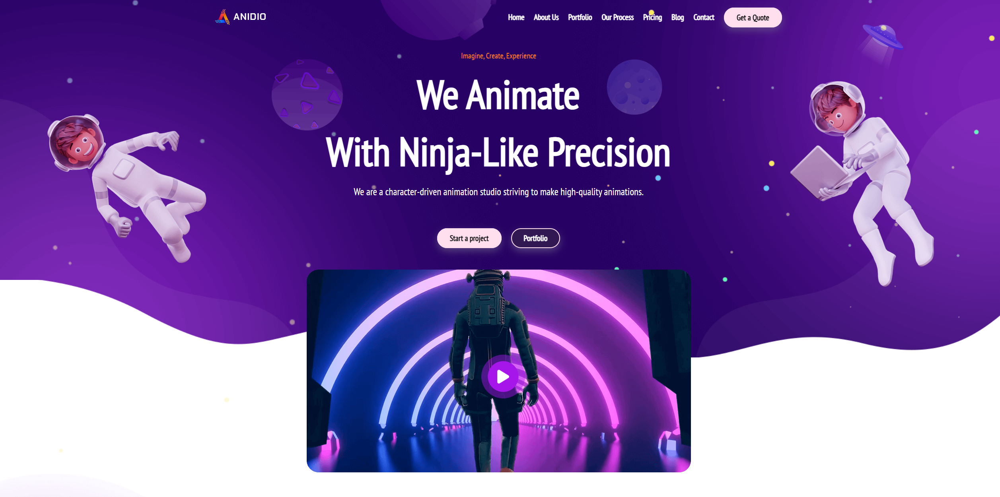

# Cartoon Agency

## Introduction
Welcome to the Cartoon Agency project powered by ANIDIO! 

Anidio is your one-stop destination for all things animated! Whether you're looking to add some flair to your website, spice up your presentations, or create captivating videos, our animation agency has got you covered.

In this Vue 3 project, we're diving deep into the world of animations, offering you a glimpse into the magic behind captivating visuals and seamless transitions. From eye-catching CSS animations to dynamic SVG animations, join us on a journey where creativity knows no bounds.

Explore our gallery of animations, experiment with interactive demos, and unlock the secrets to crafting stunning motion graphics. Whether you're a seasoned developer or just getting started, there's something here for everyone to learn and enjoy.

So, buckle up and get ready to breathe life into your projects with Animation Avenue. Let's animate the world, one frame at a time.

 

### Project guidelines:

- [x]   Create Vue components folders for header, main, footer and populated them with their respective components.
- [x]   Create the basic template of the header, populating the component with a nav bar.
- [x] Create the hero content with a video showing a summary of the work.
- [x] Populate the main part of the site with all the informations a customer might need such as our productions, a simple counter that's keeping track of our milestones and a couple of carousels with our CEO and employees as well as our sponsors.
- [x] Create a footer with a simple form to get notified via e-mail about our latest creations and collaborations.
- [x] Animate all the background elements such as the astronauts levitating in space and the planets behind them.

 

## About this project: 

---

## Follow my journey through:  

---

## Contact me:
&nbsp;&nbsp;&nbsp;&nbsp;&nbsp;&nbsp;&nbsp; 

##### Acknowledgments
 Special thanks to **Boolean** for their valuable contributions.